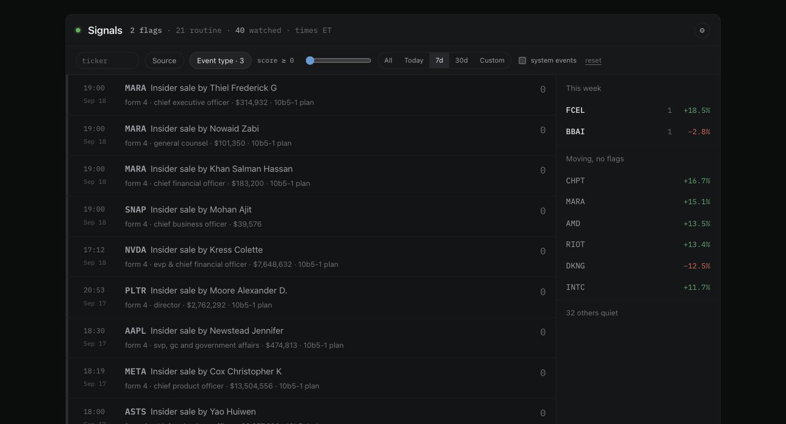
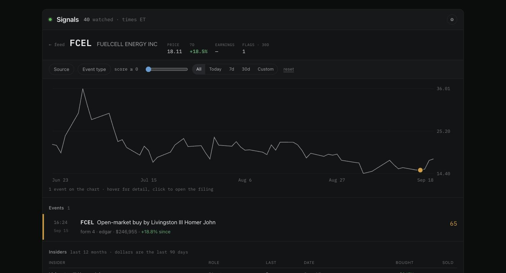

# Signals

One feed for everything that happens to the companies you watch — pulled from the
original public sources when they publish, not when someone writes it up.

Personal tool. Public data only. Finds signals; makes no decisions.

## Why the scoring is the point

Two insider purchases from the same week, as the system scored them:

| | Score | Why |
|---|---|---|
| **FCEL** — a director buys $246,955 on the open market | **65** | base 40 + large stake relative to holdings 20 + director 5. The stock was up 18.8% three days later. |
| **CRBG** — Nippon Life buys **$7.4 million** | **20** | base 40 + over $1M 10 − **10b5-1 plan 30**. Below the flag threshold; never pushed. |

The second purchase is thirty times larger and scores a third as much, because it
was scheduled months in advance under a 10b5-1 plan — so it says nothing about
what the buyer thinks *today*, which is the only thing an insider purchase is
evidence of. Without that penalty it scores 50 and reads as a high-priority signal.
Most Form 4 traffic (grants, option exercises, tax withholding) scores zero.

## Findings

Building this against live data turned up several places where the obvious
approach — and the original design — was wrong. The full log is in
[STATUS.md](STATUS.md); three worth knowing:

- **`browse-edgar?type=4` is a prefix match.** It returns 424B2 prospectuses alongside Form 4s; only 38% of "Form 4" results were Form 4s until filtered.
- **The 10b5-1 flag has three encodings** in live filings (`1`, `0`, `false`). A truthiness check reads `"false"` as yes and inverts the signal.
- **A 150–1,400 s latency tail was the laptop sleeping**, not SEC — found by stamping every event with the poll gap before it, then matching `pmset`'s log to the second. Awake, acceptance-to-stored is 21–33 s.

## Run it

    cp .env.example .env      # set SEC_USER_AGENT to a real contact address
    cp config/watchlist.example.yml config/watchlist.yml   # optional: your own tickers
    make up                   # postgres, redis, worker, api
    make migrate && make seed
    make web                  # build the UI
    open http://localhost:8000

The worker polls 06:00–22:00 ET on trading days and idles otherwise. A quiet feed
is the normal state: forty watched companies mostly do nothing, and the design
target is under twenty flags a day. If a source stops polling, that appears in
the feed as a flag of its own.

## What it watches

| Source | Signal | How |
|---|---|---|
| EDGAR 8-K | Material events, scored by item number | index poll, 2 s — items come free in the index |
| EDGAR Form 4 | Open-market insider buys; grants and sales score 0 | index poll + one document fetch per watched filing |
| EDGAR 13D/G | Activist (85) vs passive (30) stakes | index poll, 4 s |
| Trading halts | News pending, regulatory, volatility | Nasdaq Trader RSS, 10 s — covers NYSE/Arca/AMEX too |
| Prices | `price_at` on every flag, weekly change, earnings dates | yfinance, best-effort, never blocks a flag |

`config/watchlist.yml` is gitignored — what you watch is your own business. Without
one, seeding falls back to the committed example. After editing:
`make seed && docker compose restart worker`.

## Using it

**The feed** takes a filter bar — tickers (typeahead, multi-select), source, event
type, a score slider and a date range — and keeps all of it in the URL, so a view
can be bookmarked or shared. The score slider is *your* display threshold and is
not saved. System events (a source going quiet, the host having slept) live in a
strip above the feed rather than among the flags.

**Click any ticker** for its company page: price with events pinned to the day they
happened, the company's events, and an insider table of dollars bought against
dollars sold.

**The flag threshold** — what gets pushed and price-stamped — is a separate control
under the gear icon. Changing it needs `ADMIN_TOKEN` from `.env` and never deletes
anything: every event is stored at its score regardless.

## Layout

    src/signals/parsers/    pure: bytes in, dataclasses out. No IO, no clock.
    src/signals/scoring/    pure: one 0–100 scale, every constant in tables.py
    src/signals/adapters/   fetch + normalize, one per source
    src/signals/pipeline/   runner, processor, cluster promotion, watchdog, prices
    src/signals/store/      the only SQL in the project (queries.py)
    src/signals/api/        FastAPI: /api/feed /api/watchlist /api/stats /ws
    web/                    React feed + rail
    tests/fixtures/         real captured payloads; tests never touch the network

The purity of `parsers/` and `scoring/` is enforced by import-linter, not convention.

`STATUS.md` has the build log: what was measured live, where the original spec
turned out to be wrong, and what has not yet been observed in production.
